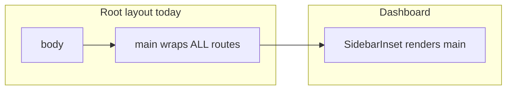

# GIQ-52 — ACC-03 Landing & Login: keyboard and interaction upgrades

## Requirements summary

From [Linear GIQ-52](https://linear.app/meltstudio/issue/GIQ-52):

| Theme             | Acceptance (condensed)                                                                                                                                                                                         |
| ----------------- | -------------------------------------------------------------------------------------------------------------------------------------------------------------------------------------------------------------- |
| **Skip link**     | First focusable element on the page when tabbing from the top is **“Skip to main content”** (visually hidden until focused); activating moves focus to the **standardized primary content landmark**.          |
| **Hover / focus** | For interactive controls with dynamic supplemental content (hover focus), content **remains visible** while hover/focus **stays** on the trigger (WCAG **1.4.13 Content on Hover or Focus** where applicable). |
| **Touch targets** | Interactive icon controls have a **≥ 44×44 CSS px** hit area (prefer **padding** so Lucide icon sizes can stay ~20px).                                                                                         |
| **Coordination**  | Align **main landmark + skip target** with **ACC-06 (page structure)**—single clear `#main-content` pattern.                                                                                                   |

**Standard:** Treat all new or changed behavior as **WCAG 2.1 Level AA** (with **1.4.13** and **2.4.1 Bypass Blocks** called out explicitly for this story). The ticket’s 44×44 requirement is stronger than WCAG 2.1 AA’s minimum target wording; honor it as a product requirement.

## Relation to recent work (commit `65e2d0cc`)

Commit `65e2d0cc` implements **GIQ-51** (icons + toast/inline error **`role="alert"`**, **`aria-hidden`** on decorative arrows/loaders):

- [`src/features/auth/forms/forgot-password-form.tsx`](../src/features/auth/forms/forgot-password-form.tsx), [`src/features/auth/forms/reset-password-form.tsx`](../src/features/auth/forms/reset-password-form.tsx) — announcements and labeled icons unchanged by ACC-03 except where focus/touch wrappers are added adjacent to icons.
- [`src/features/auth/hooks/useLogin.tsx`](../src/features/auth/hooks/useLogin.tsx) — custom error toast still uses **`role="alert"`** on the inner div; preserve when adjusting layout/focus/chrome.
- [`src/features/users/hooks/useCreateFirstUserForm.ts`](../src/features/users/hooks/useCreateFirstUserForm.ts), [`src/shared/components/form-hook-helper/helper.tsx`](../src/shared/components/form-hook-helper/helper.tsx) — validation summary **`role="alert"`** remains; **`Loader2`** in submit row is **`aria-hidden`**.

Regression pass for ACC-03: re-run SR/keyboard flows on **`/login`**, **`/forgot-password`**, **`/reset-password`**, **`/login/create-first-user`** after landmark/skip/layout changes.

## PRD alignment

Implements **Component A — Landing & Login** via PRD `features/accessibility/prd.md` (cited on the issue—file may live outside repo; cite Linear as source of truth if missing locally).

## Codebase discoveries (constraints)

- Root [`src/app/layout.tsx`](../src/app/layout.tsx): historically **`<main>{children}</main>`** wrapped the entire app (nested **`<main>`** with [`SidebarInset`](../src/shared/components/ui/sidebar.tsx) rendered **`<main>`** — invalid HTML).

**Recommendation for GIQ-52 + ACC-06 alignment**

1. **Remove the outer wrapping `<main>`** from root [`layout.tsx`](../src/app/layout.tsx) so each shell owns exactly **one** primary `<main>` (landing, auth, dashboard).
2. **Stable skip target**: `id="main-content"` **`tabIndex={-1}`** on that single `<main>` per route shell (matching Linear’s “standardized main-content landmark”).
3. **Landing** [`src/app/(landing)/landing-page.tsx`](<../src/app/(landing)/landing-page.tsx>): hoist **`<Navbar />`** _above_ primary `<main id="main-content">` so activating skip skips the repetitive header.
4. **Auth** [`src/app/(auth)/layout.tsx`](<../src/app/(auth)/layout.tsx>): wrap `children` in **`<main id="main-content" tabIndex={-1}>`** (single column login surfaces—matches GIQ-50/GIQ-51 routes).
5. **Dashboard** [`src/app/(dashboard)/layout.tsx`](<../src/app/(dashboard)/layout.tsx>): pass **`id="main-content"`** and **`tabIndex={-1}`** into **`SidebarInset`** so skip targets **inset primary content**, not sibling sidebar chrome (consistent with bypass intent).

**Payload admin** [`src/app/(payload)/layout.tsx`](<../src/app/(payload)/layout.tsx>) is Payload-generated shell—**risk** if `#main-content` never mounts. Planned mitigations:

- Prefer **SSR-safe** `<a href="#main-content">` only if `main#main-content` is guaranteed once root wrapper is adjusted; validate **`/admin` (or Payload path)** manually.
- If no matching id: either minimal wrapper in Payload custom layout (team approval—file is “do not modify” auto-generated **or** sibling override documented in ACC-06) **or** a tiny client guard (last resort)—note as **Open question**.

## Hover / focus audit scope (landing + login shells)

Landing currently has **no** Radix `Tooltip`/`HoverCard` in `src/features/landing`; likely gaps are **`hover:` utilities without `:focus-visible` counterparts** on **keyboard focus** ([`navbar.tsx`](../src/features/landing/components/navbar.tsx) anchor links; [`footer.tsx`](../src/features/landing/components/footer.tsx) / [`faq-section.tsx`](../src/features/landing/components/faq-section.tsx) utility links):

- Align with existing button focus ring vocabulary in [`buttonVariants`](../src/shared/components/ui/button.tsx) (`focus-visible:ring-*`).
- Apply **`focus-visible:`** styles wherever **`hover:`** exposes “dynamic” styling that implies interaction (accent change, underline, background), so supplemental visual state **does not disappear** solely because the modality is keyboard.

**Explicit ticket acceptance** (“dynamic supplemental content persists while hover/focus remains”): grep landing + `(auth)` for **`Popover`/`Dropdown`/`HoverCard`** and any **`group-hover`**-only disclosures; patch to **`group-focus-within`** or Radix-managed focus where needed. If zero instances, record **explicit negative finding** plus nav/footer/link fixes above as satisfying interaction visibility for prototype scope.

## Touch target work (landing icons in scope)

- **Footer**: Mail + LinkedIn in [`footer.tsx`](../src/features/landing/components/footer.tsx) — **`inline-flex`** + **`min-h-11 min-w-11`** (44px) **`items-center justify-center`**; keep **`aria-label`** + **`aria-hidden` on SVG**.
- **Navbar** mobile toggle: **`size="icon"`** was **`size-9`** (36px)—bump to **≥44px** via `className` while preserving design.

Representative manual touch QA: iOS/Android narrow viewport footer + navbar menu.

## Files to modify / create (expected)

| Path                                                   | Change                                                                                                           |
| ------------------------------------------------------ | ---------------------------------------------------------------------------------------------------------------- |
| `.plans/giq-52.md`                                     | Plan artifact (`sprint: TBD`, `standard`, `linear_url`, `relationship_to_51_commit`).                            |
| `src/shared/components/skip-to-main-content/index.tsx` | Reusable Skip link (“Skip to main content”), **visually hidden until `:focus-visible`**, `href="#main-content"`. |
| `src/app/layout.tsx`                                   | **Skip** as **first focusable inside `body`**; **remove wrapper `<main>`**; keep **`Toaster`**.                  |
| `src/app/(landing)/landing-page.tsx`                   | **`Navbar`** → **`main id="main-content"`** … → **`Footer`**.                                                    |
| `src/app/(auth)/layout.tsx`                            | **`main#main-content`** wrapper.                                                                                 |
| `src/app/(dashboard)/layout.tsx`                       | **`SidebarInset`** gets **`id` + `tabIndex={-1}`**.                                                              |
| `src/features/landing/components/footer.tsx`           | Touch target sizing; **`:focus-visible`** parity with hover.                                                     |
| `src/features/landing/components/navbar.tsx`           | Menu button min tap target + **`:focus-visible`** on nav anchors.                                                |

## Implementation steps (ordered)

1. **Landmark refactor** — root layout + landing/auth/dashboard `main id="main-content"` as above; fix nested-main bug.
2. **Skip component** — first DOM focus order in `body` before route chrome; `:focus-visible` styling (off-screen reveal pattern).
3. **Hit areas** — footer social/mail icons + navbar hamburger (**≥ 44px**).
4. **Interaction parity** — `hover:`/`focus-visible:`/`group-focus-within:` audit per section above.
5. **Lint/typecheck** — `pnpm ci:checks` ([AGENTS.md](../AGENTS.md)).

## Validation plan

| #   | Acceptance                               | Method                                                                                                                                                                  |
| --- | ---------------------------------------- | ----------------------------------------------------------------------------------------------------------------------------------------------------------------------- |
| 1   | Skip is first Tab stop                   | Landing `/`, `/login`, dashboard after login—and spot-check Payload (`/admin` if exposed).                                                                              |
| 2   | Activate skip → focus on `#main-content` | Keyboard Enter/Space on skip; VO/NVDA “focus moved” check.                                                                                                              |
| 3   | Landing bypass sanity                    | After skip **from `/`**, next logical tab order hits **Hero** before exhausting sticky nav (Navbar outside `<main>` ).                                                  |
| 4   | Hover/focus persistent styling           | Navigate footer + navbar + FAQ buttons with Tab; compare to pointer hover appearance.                                                                                   |
| 5   | 44×44 targets                            | DevTools / accessibility target-size tooling; physical device taps on footer + menu.                                                                                    |
| 6   | GIQ-51 regression                        | Wrong-password login toast + forgot/reset inline errors remain announced (**`role="alert"`**); arrows decorative (**`aria-hidden`**).                                   |
| 7   | Automated                                | Browser **axe-core** on **`/`**, `/login`, `/forgot-password`, `/reset-password`, `/login/create-first-user`, one dashboard route (**zero critical** where applicable). |
| 8   | UX completeness                          | `/melt-ux-audit` on landing + login flows (loading/error/empty as applicable).                                                                                          |

## Edge cases & risks

- **Duplicate `id="main-content"`** if any layout nests two mains—prevent by single-main-per-shell rule after root refactor.
- **Payload / third-party iframe embeds**: skip target may not exist—validate and document mitigation.
- **Skip + modal open**: dialogs that portal to body should remain above skip in DOM yet not steal initial tab unless focused—defer deep modal/tab-order rework unless regressions observed.
- **Sidebar mobile sheet**: sidebar focus traps may reorder tab stops differently from inset `main`; retest **SidebarTrigger** + **SidebarInset** combo.

## Non-code changes

- None mandatory; optional **axe** / `eslint-plugin-jsx-a11y` policy if already on roadmap (not assumed).

## Open questions

1. **Payload CMS route**: Confirm whether **`#main-content`** must be guaranteed there in GIQ-52 or deferred purely to ACC-06.
2. **Global non-landing icon buttons** (e.g. shared `size="icon"` defaults): ticket says “no backfill”—only change controls called out in design (footer + landing navbar) unless PM expands scope.

## Git

Suggested branch (Linear): `feature/giq-52-acc-03-landing-login-keyboard-and-interaction-upgrades`.
